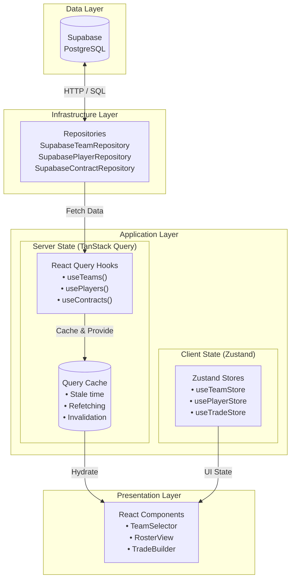
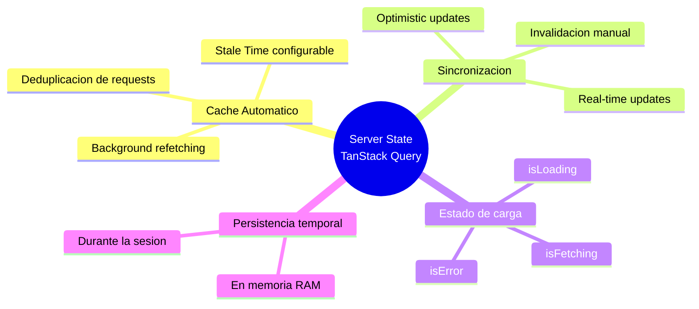
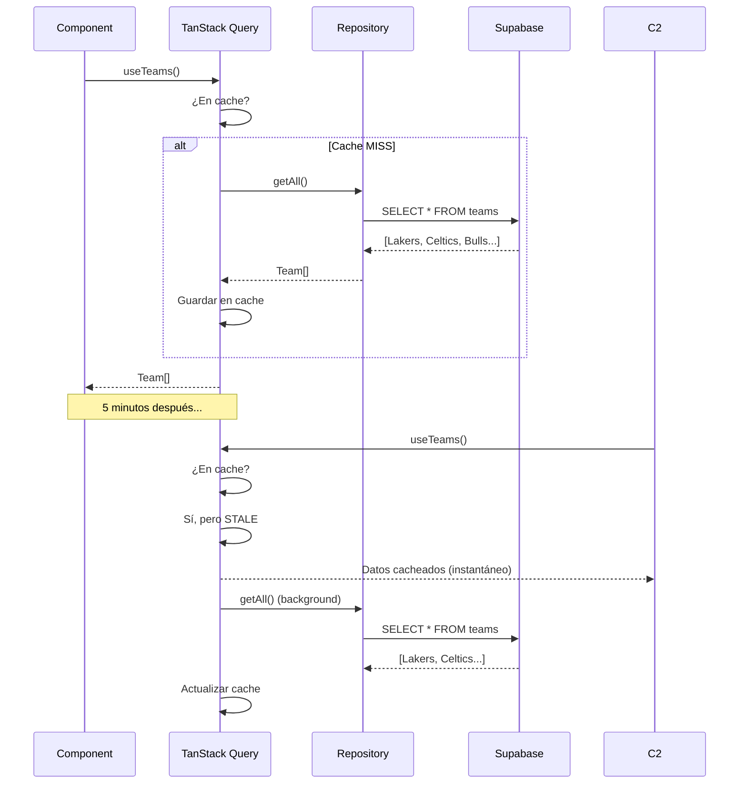
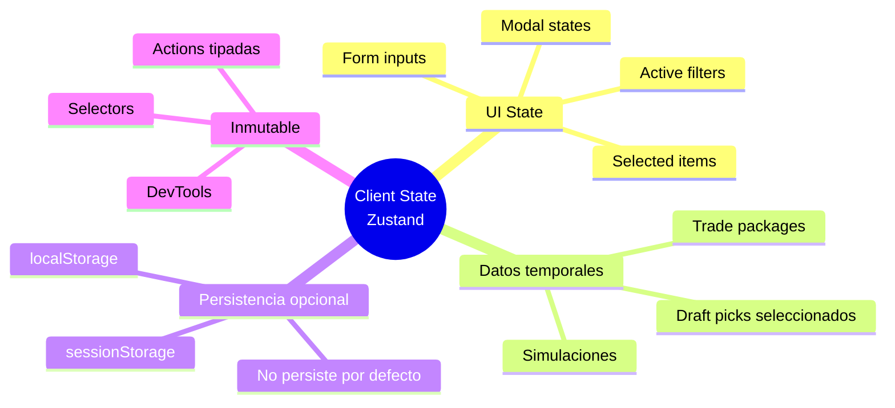
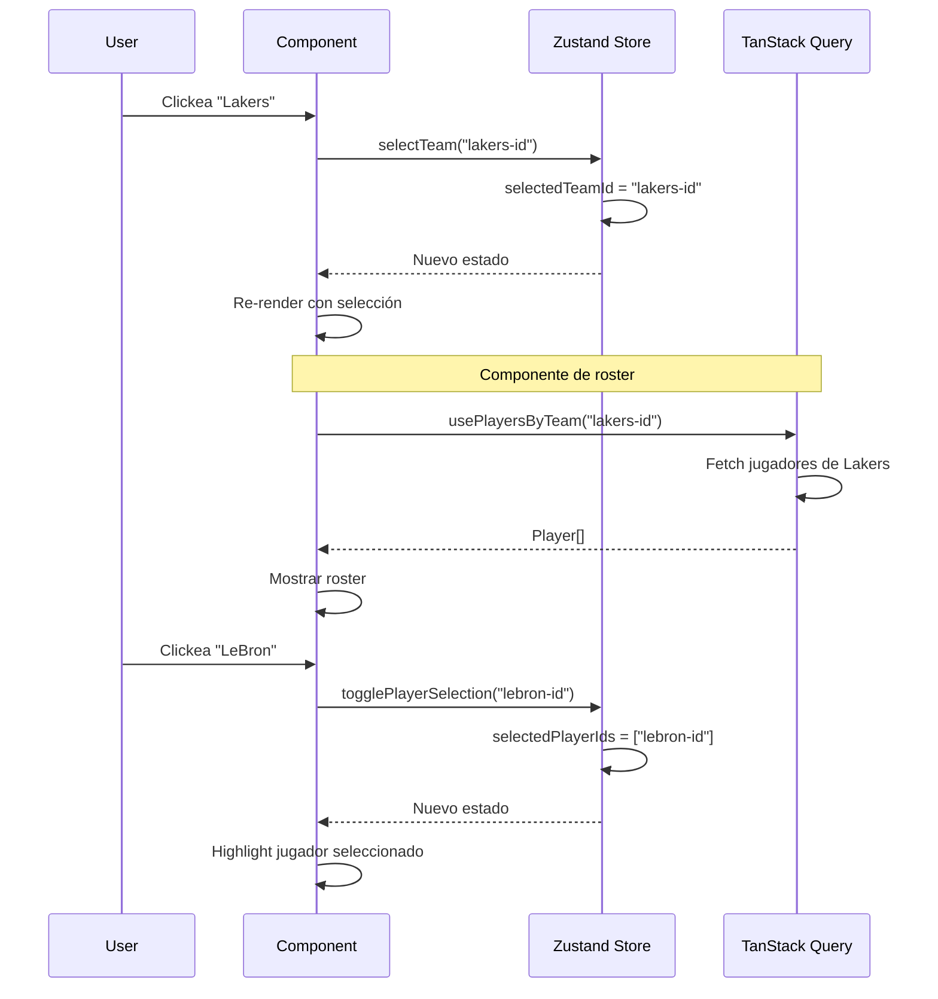
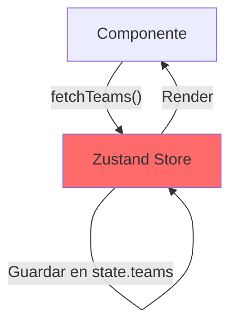
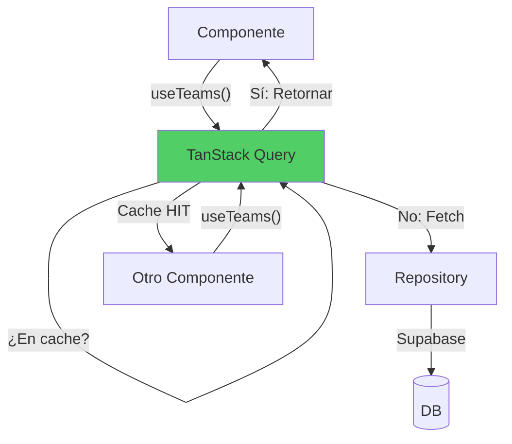
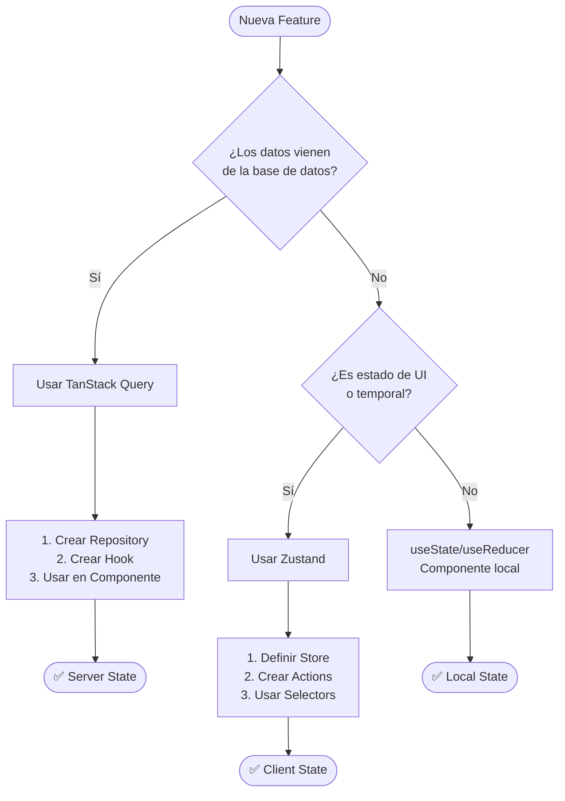

# Arquitectura de Estado en "The Association"

## Server State vs Client State

Esta guía explica la separación de responsabilidades entre TanStack Query (Server State) y Zustand (Client State) en nuestro simulador de NBA GM.

---

## Diagrama de Arquitectura General



---

## Server State (TanStack Query)

### ¿Qué guarda?
- Datos de la base de datos
- Equipos, jugadores, contratos
- Stats y resultados
- Cache de peticiones HTTP

### Características


### Ejemplo de Flujo



---

## Client State (Zustand)

### ¿Qué guarda?
- Selecciones del usuario
- Filtros activos
- Estado de UI (modales abiertos, etc)
- Datos temporales (traspaso en progreso)

### Características


### Ejemplo de Flujo



---

## Caso de Uso: Armar un Traspaso

```mermaid
flowchart LR
    subgraph "Paso 1: Seleccionar Equipos"
        A1["useTeamStore<br/>setTeamA('lakers')"]
        A2["useTeamStore<br/>setTeamB('celtics')"]
    end

    subgraph "Paso 2: Seleccionar Jugadores"
        B1["usePlayerStore<br/>togglePlayer('lebron')"]
        B2["usePlayerStore<br/>togglePlayer('ad')"]
        B3["useTradeStore<br/>addPlayerToTrade()"]
    end

    subgraph "Paso 3: Validar"
        C1["useTradeStore<br/>validationResult"]
        C2["Calcular Salarios<br/>Reglas CBA"]
    end

    subgraph "Paso 4: Ejecutar"
        D1["API Route<br/>/api/trades"]
        D2["Invalidar Cache<br/>queryClient.invalidate"]
    end

    A1 --> A2 --> B1 --> B2 --> B3 --> C1 --> C2 --> D1 --> D2
```



---

## Comparación Detallada

| Aspecto | TanStack Query (Server State) | Zustand (Client State) |
|---------|------------------------------|------------------------|
| **Origen** | Base de datos (Supabase) | Interacción del usuario |
| **Persistencia** | Cache temporal | localStorage (opcional) |
| **Scope** | Global (toda la app) | Global (toda la app) |
| **Mutabilidad** | Inmutable | Inmutable |
| **Sync** | Automática con servidor | Manual |
| **Re-fetch** | Background automático | N/A |
| **Ejemplos** | Teams, Players, Contracts | SelectedTeam, Filters, TradePackage |

---

## Anti-Patrones a Evitar

### ❌ Guardar datos de la DB en Zustand



**Problemas:**
- Duplicación de estado
- Cache manual (propenso a errores)
- No hay invalidación automática
- Múltiples requests si varios componentes montan

### ✅ Usar TanStack Query para Server State



**Ventajas:**
- Deduplicación automática
- Cache inteligente
- Refetching background
- DevTools integrados

---

## Estructura de Carpetas Recomendada

```
src/
├── application/
│   ├── hooks/                    # TanStack Query hooks
│   │   ├── teams/
│   │   │   ├── useTeams.ts       # Server state
│   │   │   ├── useTeam.ts        # Server state
│   │   │   └── useTeamPlayers.ts # Server state
│   │   ├── players/
│   │   │   └── usePlayers.ts     # Server state
│   │   └── contracts/
│   │       └── useContracts.ts   # Server state
│   │
│   └── stores/                   # Zustand stores
│       ├── useTeamStore.ts       # Client state (filters, selection)
│       ├── usePlayerStore.ts     # Client state (selection)
│       └── useTradeStore.ts      # Client state (trade builder)
│
└── infrastructure/
    └── repositories/             # Data access layer
        ├── SupabaseTeamRepository.ts
        ├── SupabasePlayerRepository.ts
        └── SupabaseContractRepository.ts
```

---

## Checklist de Implementación

Al agregar una nueva feature, preguntate:



---

## Ejemplo Completo: TeamSelector

```typescript
// components/TeamSelector.tsx
import { useTeams } from "@/application/hooks/teams/useTeams";
import { useTeamStore, selectSelectedTeamId } from "@/application/stores";

export function TeamSelector() {
  // SERVER STATE: Datos de Supabase
  const { data: teams, isLoading, error } = useTeams();
  
  // CLIENT STATE: Qué seleccionó el usuario
  const selectedTeamId = useTeamStore(selectSelectedTeamId);
  const selectTeam = useTeamStore((state) => state.selectTeam);
  const setSearchQuery = useTeamStore((state) => state.setSearchQuery);
  const searchQuery = useTeamStore((state) => state.searchQuery);

  if (isLoading) return <div>Cargando equipos...</div>;
  if (error) return <div>Error: {error.message}</div>;

  // Filtrado en cliente (podría ser en servidor también)
  const filteredTeams = teams?.filter(team => 
    team.name.toLowerCase().includes(searchQuery.toLowerCase()) ||
    team.city.toLowerCase().includes(searchQuery.toLowerCase())
  );

  return (
    <div>
      {/* CLIENT STATE: Filtro de búsqueda */}
      <input
        type="text"
        placeholder="Buscar equipo..."
        value={searchQuery}
        onChange={(e) => setSearchQuery(e.target.value)}
      />

      {/* SERVER STATE: Lista de equipos */}
      <div className="grid grid-cols-3 gap-4">
        {filteredTeams?.map((team) => (
          <button
            key={team.id}
            onClick={() => selectTeam(team.id)}
            className={selectedTeamId === team.id ? "selected" : ""}
          >
            
            <span>{team.city} {team.name}</span>
          </button>
        ))}
      </div>
    </div>
  );
}
```

---

## Reglas de Oro

1. **Si viene de la DB → TanStack Query**
   - Equipos, jugadores, contratos, estadísticas
   - Cualquier dato que otros usuarios puedan modificar

2. **Si es interacción del usuario → Zustand**
   - Qué equipo está seleccionado
   - Qué jugadores elegí para un traspaso
   - Filtros activos en la UI

3. **Si es temporal y local → useState**
   - Input de un formulario antes de enviar
   - Estado de un modal (abierto/cerrado)
   - Hover states, animaciones

4. **Nunca dupliques Server State en Client State**
   - No guardes `teams` en Zustand
   - Usá los hooks de TanStack Query

---

## Recursos

- [TanStack Query Docs](https://tanstack.com/query/latest)
- [Zustand Docs](https://docs.pmnd.rs/zustand)
- [React Query vs Redux](https://tkdodo.eu/blog/react-query-and-graphql)

---

*Documento creado para "The Association" - NBA GM Simulator*
