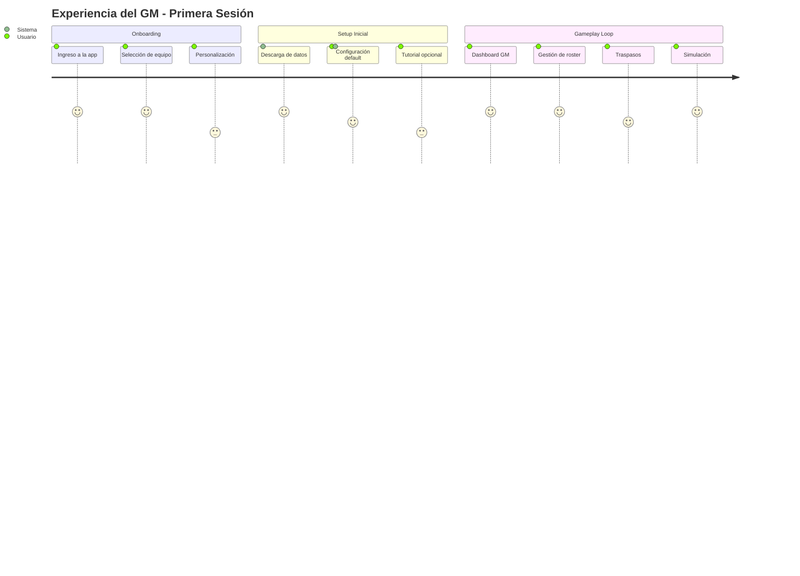
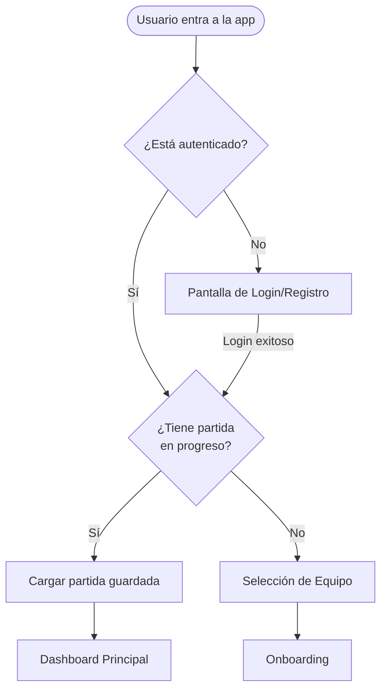
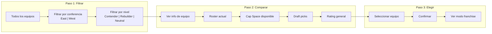
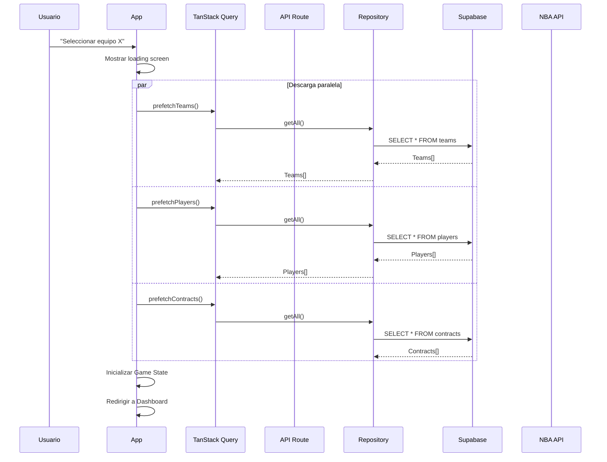
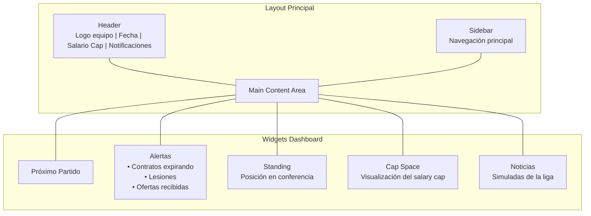
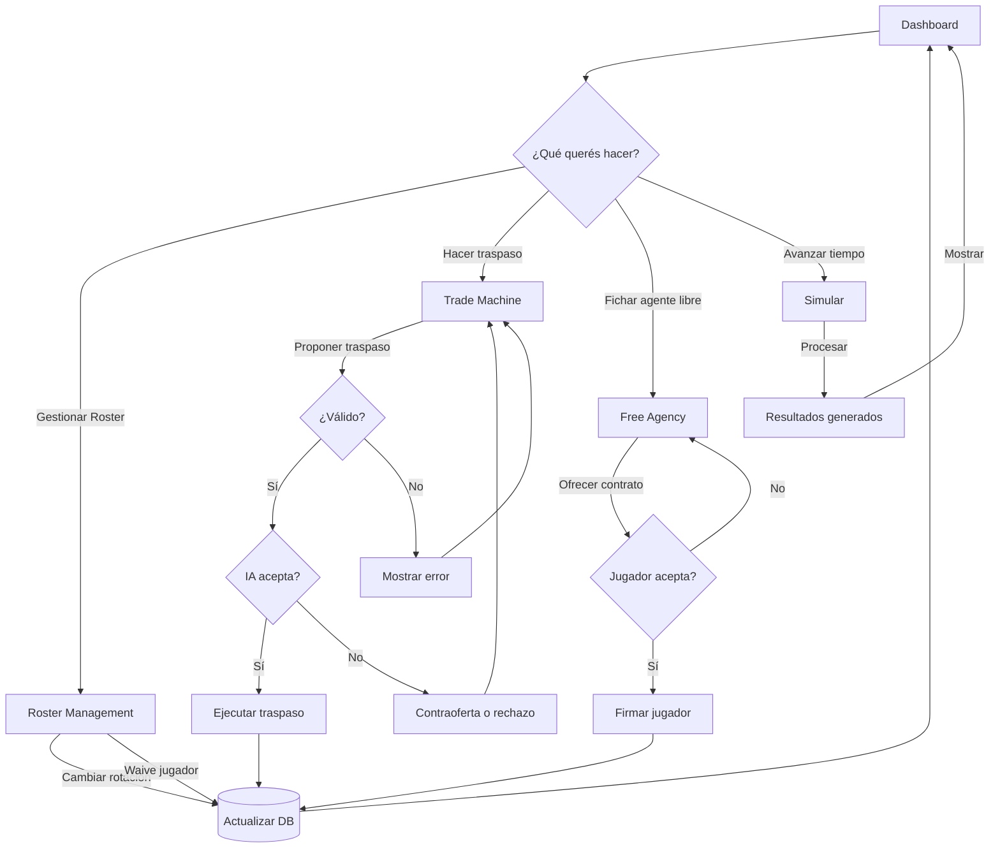
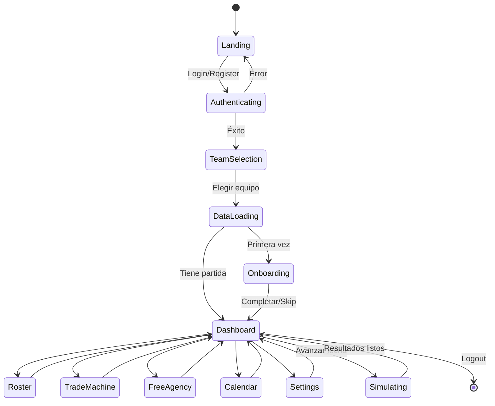

# Flujo de Usuario - "The Association"

## Visión General

El jugador toma el rol de General Manager (GM) de un equipo NBA. La experiencia está diseñada para ser inmersiva, estratégica y realista.

---

## User Journey Map



---

## Flujo Detallado por Etapa

### 1. Landing / Ingreso



**Pantalla de Login:**
- Email + Password (Supabase Auth)
- OAuth opcional (Google, GitHub)
- "Jugar como invitado" (datos locales, no persisten)

---

### 2. Selección de Equipo



**Información mostrada por equipo:**
- Logo, ciudad, nombre
- Conference/Division
- Roster (top 5 jugadores con rating)
- Cap Space: `$45M / $140M` (con barra visual)
- Luxury Tax status
- Draft picks disponibles
- Objetivo de la franquicia (según datos reales)

**Clasificación de equipos:**
```typescript
type TeamDifficulty = 
  | "contender"     // Lakers, Celtics, Nuggets (difícil mantener)
  | "playoff-team"  // Heat, Suns, 76ers (balanceado)
  | "rebuilder"     // Pistons, Wizards, Spurs (fácil reconstruir)
  | "tanker";       // Equipos con picks altos
```

---

### 3. Descarga de Plantillas (Data Sync)



**Datos que se descargan:**
1. **Equipos** - Info básica de los 30 equipos
2. **Jugadores** - Todos los jugadores activos (~500)
3. **Contratos** - Todos los contratos vigentes
4. **Stats** (opcional v1) - Stats de la temporada actual

**Opciones de Configuración Inicial:**
```typescript
interface GameSettings {
  // Fecha de inicio
  startDate: "2024-10-22"; // Inicio temporada 2024-25
  
  // Dificultad
  difficulty: "rookie" | "pro" | "hall-of-fame";
  
  // Opciones de simulación
  simulationSpeed: "daily" | "weekly" | "monthly";
  autoSave: boolean;
  saveFrequency: "on-exit" | "daily" | "weekly";
  
  // Reglas
  tradeDeadline: boolean;       // Respetar deadline
  salaryCapRules: "strict" | "relaxed";
  injuriesEnabled: boolean;
  
  // Display
  currencyFormat: "short" | "full";  // $45M vs $45,000,000
  showAdvancedStats: boolean;
}
```

---

### 4. Dashboard Principal (Hub)



**Secciones de Navegación:**
1. **Dashboard** - Overview y alertas
2. **Roster** - Gestión de plantilla
3. **Calendario** - Partidos y resultados
4. **Traspasos** - Trade machine y ofertas
5. **Agencia Libre** - FAs disponibles
6. **Draft** - Scouts y picks
7. **Finanzas** - Salary cap detallado
8. **Configuración** - Settings del juego

---

### 5. Core Gameplay Loop



---

## Opciones por Defecto (Configuración)

### Perfiles Pre-definidos

```typescript
const DEFAULT_PROFILES = {
  rookie: {
    difficulty: "rookie",
    tradeDifficulty: "easy",      // IA más permisiva
    salaryCapRules: "relaxed",    // Margen de error mayor
    injuriesEnabled: false,
    autoSave: true,
    simulationSpeed: "weekly",
    tutorialEnabled: true,
    hintsEnabled: true,
  },
  
  pro: {
    difficulty: "pro",
    tradeDifficulty: "medium",    // IA realista
    salaryCapRules: "strict",     // Reglas CBA estrictas
    injuriesEnabled: true,
    autoSave: true,
    simulationSpeed: "daily",
    tutorialEnabled: false,
    hintsEnabled: true,
  },
  
  hallOfFame: {
    difficulty: "hall-of-fame",
    tradeDifficulty: "hard",      // IA dura en negociaciones
    salaryCapRules: "strict",
    injuriesEnabled: true,
    autoSave: false,              // Manual save only
    simulationSpeed: "daily",
    tutorialEnabled: false,
    hintsEnabled: false,          // Sin ayudas
    ironmanMode: true,            // Una sola partida, si te echan perdés
  }
};
```

### Configuración Default (Primera vez)

```typescript
const DEFAULT_GAME_CONFIG: GameSettings = {
  startDate: new Date().toISOString().split('T')[0], // Hoy
  currentSeason: 2024,
  
  // Equipo seleccionado por usuario
  userTeamId: null, // Se setea en selección
  
  // Dificultad
  difficulty: "pro",
  
  // Simulación
  simulationSpeed: "daily",
  autoSave: true,
  saveFrequency: "daily",
  
  // Reglas
  tradeDeadline: true,
  salaryCapRules: "strict",
  injuriesEnabled: true,
  
  // UI
  currencyFormat: "short",
  showAdvancedStats: false,
  theme: "dark",
  
  // Notificaciones
  emailNotifications: false, // En web, no tiene sentido
  tradeAlerts: true,
  injuryAlerts: true,
  contractAlerts: true,
};
```

---

## Estados del Usuario en la App



---

## Wireframes de Pantallas Clave

### 1. Selección de Equipo

```
┌─────────────────────────────────────────────────────────────┐
│  THE ASSOCIATION                              [Login/Perfil]│
├─────────────────────────────────────────────────────────────┤
│                                                             │
│  "Elige tu franquicia"                                      │
│                                                             │
│  [Todos] [East] [West] [Contenders] [Rebuilders]           │
│                                                             │
│  ┌─────────┐  ┌─────────┐  ┌─────────┐  ┌─────────┐       │
│  │  🏀     │  │  🏀     │  │  🏀     │  │  🏀     │       │
│  │ LAKERS  │  │ CELTICS │  │ BULLS   │  │ ...     │       │
│  │         │  │         │  │         │  │         │       │
│  │ ⭐ 85   │  │ ⭐ 88   │  │ ⭐ 78   │  │         │       │
│  │ $45M    │  │ $12M    │  │ $89M    │  │         │       │
│  └─────────┘  └─────────┘  └─────────┘  └─────────┘       │
│                                                             │
│  [Continuar ▶]  (deshabilitado hasta seleccionar)         │
└─────────────────────────────────────────────────────────────┘
```

### 2. Dashboard Principal

```
┌─────────────────────────────────────────────────────────────┐
│ 🏀 LAKERS                    Oct 22, 2024       [$12M Cap] │
│ GM: Usuario                                      [🔔] [⚙️]  │
├──────┬──────────────────────────────────────────────────────┤
│      │                                                      │
│ 📊   │  PRÓXIMO PARTIDO        ALERTAS           STANDING  │
│ 🏀   │  ┌──────────────┐      ┌────────────┐    ┌───────┐ │
│ 📅   │  │ vs Warriors  │      │ ! 3 contr. │    │ #3    │ │
│ 💰   │  │ Hoy 8:00 PM  │      │   expiran  │    │ West  │ │
│ 🎯   │  │ [Preparar]   │      │ ! Lesión   │    │ 2-0   │ │
│ 📝   │  └──────────────┘      └────────────┘    └───────┘ │
│ ⚙️   │                                                      │
│      │  CAP SPACE BREAKDOWN      NOTICIAS DE LIGA         │
│      │  ┌──────────────────┐     ┌────────────────────┐   │
│      │  │ Salary Cap       │     │ • Trade: Beal to...│   │
│      │  │ ████████░░ $140M │     │ • Lesión: Embiid...│   │
│      │  │ Used             │     │ • Rumor: Lillard...│   │
│      │  │ ██████░░░░ $128M │     └────────────────────┘   │
│      │  │ Available        │                              │
│      │  │ ██░░░░░░░░ $12M  │  [SIMULAR SIGUIENTE DÍA ▶]  │
│      │  └──────────────────┘                              │
└──────┴──────────────────────────────────────────────────────┘
```

---

## Decisiones de Diseño Pendientes

### 1. Progresión Temporal
- [ ] ¿Días exactos o saltos semanales?
- [ ] ¿Simular partido por partido o en bloques?
- [ ] ¿Playoffs automáticos o manual?

### 2. Interacción con otros equipos
- [ ] ¿IA propone traspasos o solo reacciona?
- [ ] ¿Notificaciones de otros GMs?
- [ ] ¿Chat/simulación de negociaciones?

### 3. Multiplayer (futuro)
- [ ] ¿Ligas privadas con amigos?
- [ ] ¿Draft online sincrónico?
- [ ] ¿Trade entre usuarios humanos?

### 4. Persistencia
- [ ] ¿Una partida por usuario o múltiples?
- [ ] ¿Cloud save automático?
- [ ] ¿Exportar/importar partidas?

---

## Checklist de Implementación

### MVP (Fase 1)
- [x] Login/Auth con Supabase
- [x] Selección de equipo
- [x] Descarga de datos (teams, players, contracts)
- [x] Dashboard básico
- [ ] Visualización de roster
- [ ] Simulación básica (avanzar días)

### Fase 2
- [ ] Trade machine básico
- [ ] Free agency simple
- [ ] Salary cap calculator
- [ ] Standing y resultados

### Fase 3
- [ ] Draft
- [ ] Playoffs
- [ ] Múltiples temporadas
- [ ] Logros/historial

---

## Notas

- **Target Audience**: Fans de NBA que juegan NBA 2K MyGM, Basketball GM, o similares
- **Diferenciador**: Realismo de datos + Simplicidad de UI
- **Monetización**: Free con features premium (estadísticas avanzadas, múltiples saves)

---

*Documento creado para definir la experiencia de usuario antes de implementación*
